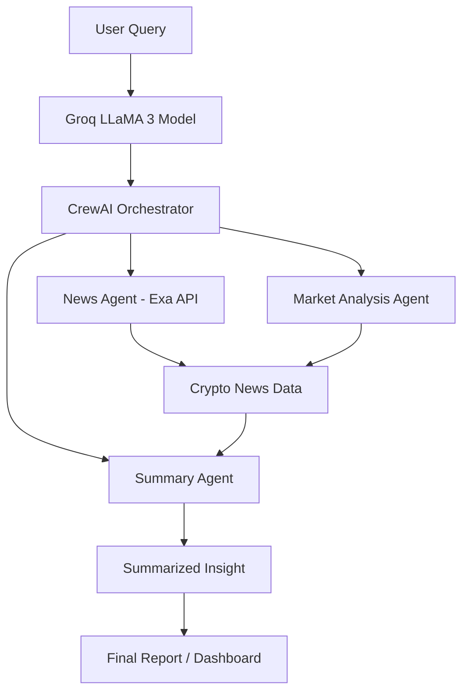

# 💰 LLM-Powered Crypto Analysis Tool

An advanced **AI-powered cryptocurrency research assistant** that combines **LLaMA 3** (via **Groq API**) with **CrewAI agents** to analyze real-time market data, news, and trends in the crypto domain.  
This project leverages **LangChain**, **Exa API**, and **DuckDuckGo Search** to provide actionable crypto insights — summarized and interpreted through an intelligent multi-agent workflow.

---

## 🧩 Project Overview

The **LLM-Powered Crypto Analysis Tool** is designed to help users understand market movements, emerging tokens, and sentiment shifts using an ensemble of agents:  
- **News Agent** → Gathers latest crypto news via Exa API  
- **Market Analyst Agent** → Interprets numerical data and patterns  
- **Summary Agent** → Generates concise, human-readable insights using LLaMA 3

These agents collaborate under **CrewAI**, orchestrating tasks intelligently for end-to-end crypto analysis.

---

## 🧠 Key Features

✅ **Real-Time Crypto News** — powered by Exa and DuckDuckGo Search  
✅ **LLM-Based Reasoning** — contextual summarization using LLaMA 3  
✅ **Multi-Agent Collaboration** — using CrewAI’s agent/task framework  
✅ **Automated Market Insights** — interprets sentiment, volatility, and events  
✅ **Scalable API Architecture** — supports multiple query pipelines  

---

## ⚙️ Architecture Overview



---

## 🧰 Tech Stack & Tools

| Category | Tools Used |
|-----------|-------------|
| **LLM Backend** | LLaMA 3 (Groq) |
| **Orchestration** | CrewAI, LangChain |
| **Data APIs** | Exa API, DuckDuckGo Search |
| **Libraries** | Pandas, NumPy, Requests |
| **Interface** | Streamlit *(optional)* |

---

## 🗂️ Project Structure

```
LLM_Powered_Crypto_Analysis_Tool/
│
├── LLM_Powered_Crypto_Analysis_Tool.ipynb   # Main notebook
├── app.py                                   # Streamlit web app (optional)
├── requirements.txt                         # Dependencies
├── README.md                                # Documentation
└── LICENSE                                  # License file
```

---

## 🚀 How to Run

### 1️⃣ Setup Environment
```bash
git clone https://github.com/<your-username>/LLM_Powered_Crypto_Analysis_Tool.git
cd LLM_Powered_Crypto_Analysis_Tool
pip install -r requirements.txt
```

### 2️⃣ Set API Keys
Add your keys in the environment variables or a `.env` file:
```bash
export GROQ_API_KEY="your_groq_api_key"
export EXA_API_KEY="your_exa_api_key"
```

### 3️⃣ Run Notebook
```bash
jupyter notebook LLM_Powered_Crypto_Analysis_Tool.ipynb
```

### 4️⃣ Launch Streamlit App (optional)
```bash
streamlit run app.py
```

---

## 🧪 Example Queries

| Query | Description |
|:------|:-------------|
| “Summarize today’s Bitcoin market sentiment” | Fetches live BTC news + generates an LLM summary |
| “Compare ETH and SOL volatility this week” | Performs comparative trend analysis |
| “Highlight top trending tokens by news mentions” | Ranks tokens using aggregated frequency metrics |

---

## 📊 Monitoring & Evaluation

- **LLM response time** (via Groq inference latency)  
- **Content freshness** (timestamped news feeds)  
- **Readability & Relevance Scores** for summaries  

---

## 🌟 Acknowledgments

- [Groq](https://groq.com/) for LLaMA 3 model inference  
- [CrewAI](https://github.com/joaomdmoura/crewai) for multi-agent orchestration  
- [LangChain](https://www.langchain.com/) for LLM workflow utilities  
- [Exa API](https://exa.ai) for real-time crypto data retrieval  
- [DuckDuckGo Search](https://pypi.org/project/duckduckgo-search/) for complementary news sourcing  

